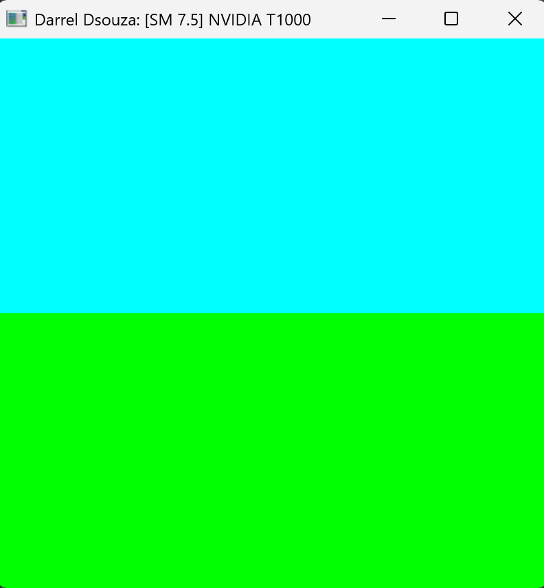
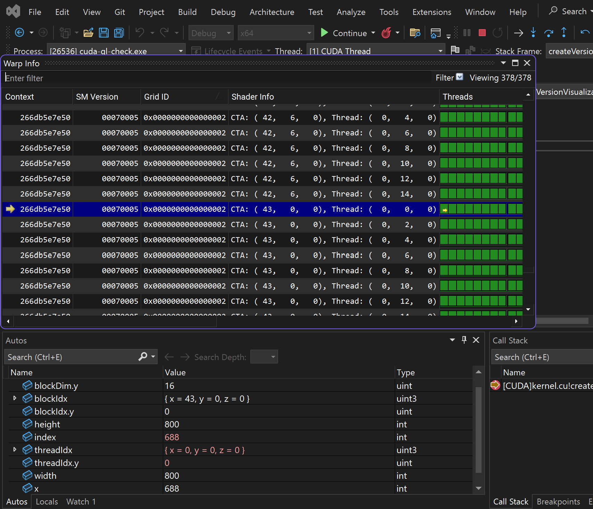
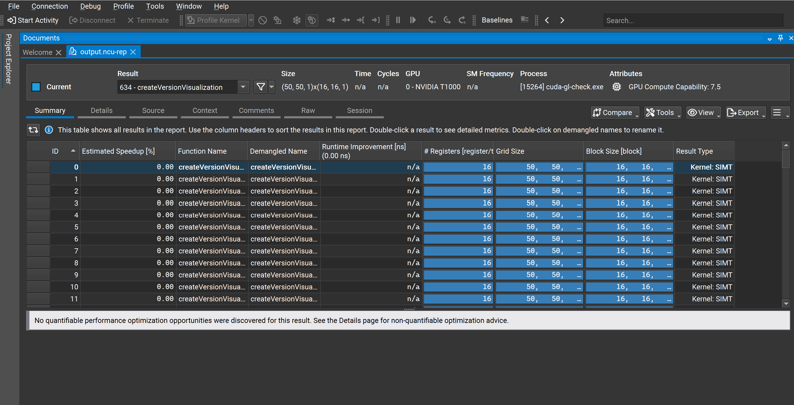
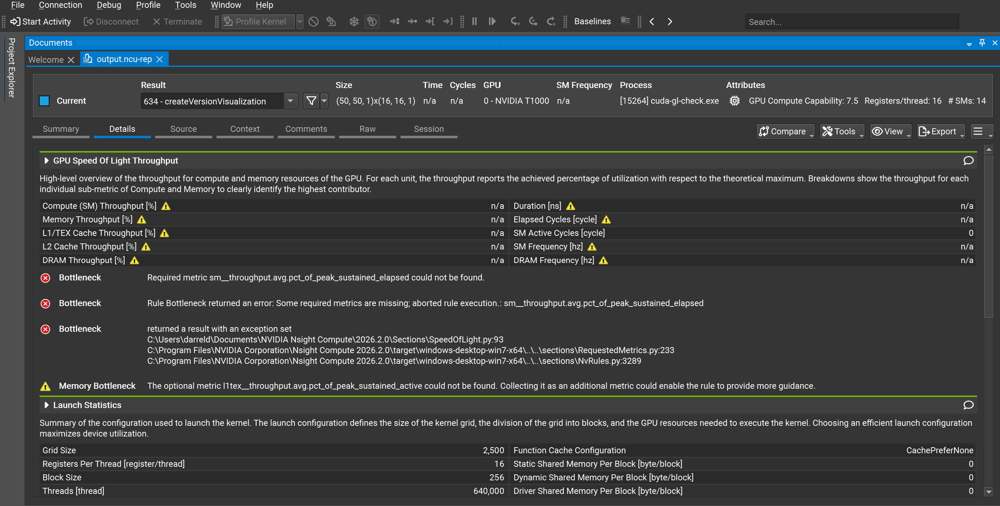
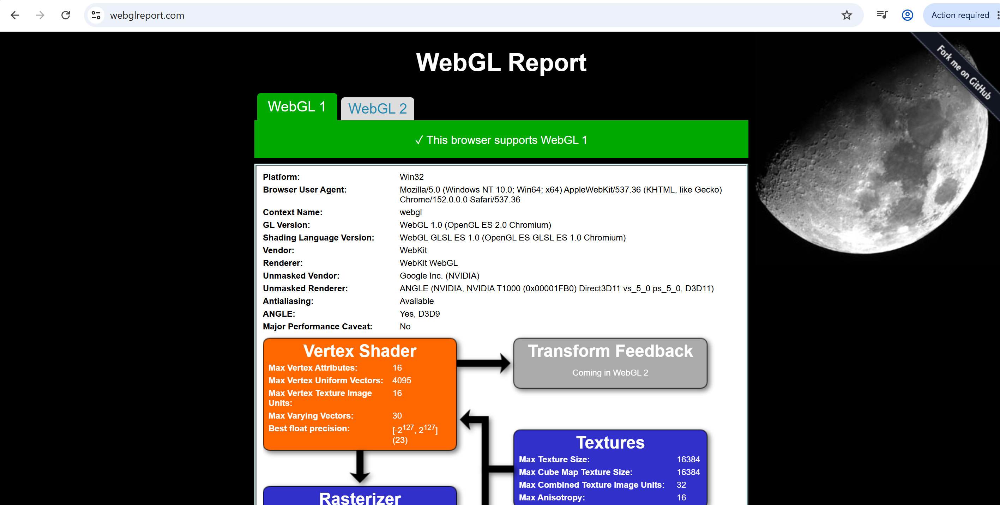
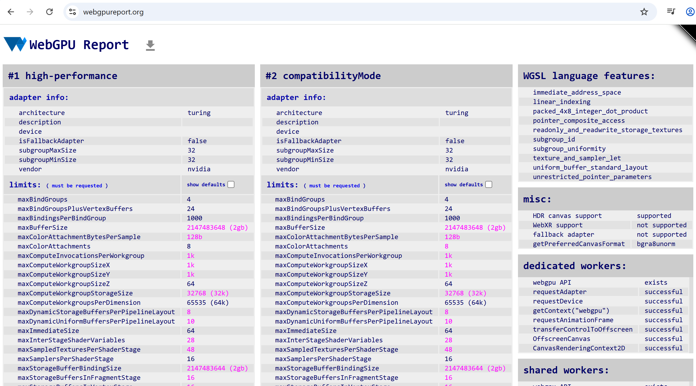

Project 0 Getting Started
====================

**University of Pennsylvania, CIS 5650: GPU Programming and Architecture, Project 0**

* Darrel Dsouza
* Tested on: Windows 11, i7-12700 @ 2.1GHz 32GB, NVIDIA T1000 4096MB (CETS Lab)
* Compute Capability: 7.5

## CUDA GL Check

## NSight Debugger

## NSight Systems

*Unable to complete on CETS lab due to lack of root access

## NSight Compute Summary

## NSight Compute Details

## WebGL

## WebGPU

